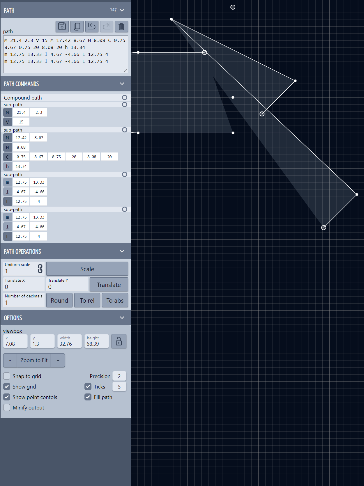

#### About

SVG path exploration

#### Credits, refs, links

WIP

[svg-path-editor](https://github.com/Yqnn/svg-path-editor)
[Animated lock icon](https://codepen.io/richardwestenra/pen/MWOYvPz)
[Custom range input that looks consistent across all browsers](https://www.smashingmagazine.com/2021/12/create-custom-range-input-consistent-browsers)
